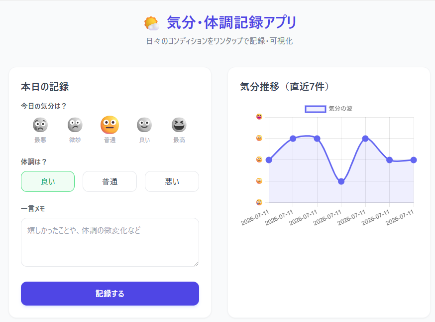
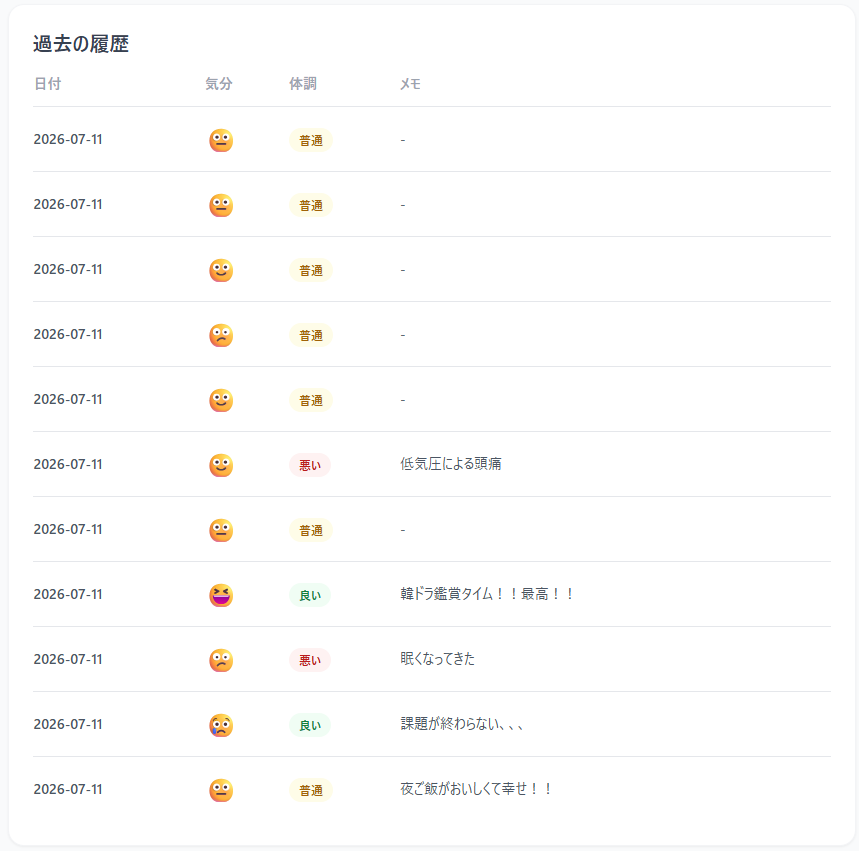

# 🌤️ 気分・体調記録アプリ (Mood & Condition Tracker)

日々の気分や体調をワンタップで簡単に記録し、グラフで視覚的に振り返ることができるコンテナ駆動型のWebアプリケーションです。

---

## 📌 システムの概要と用途
現代社会において、自身の心身のコンディションを把握することはセルフケアの第一歩です。本アプリは、ユーザーが「今日の気分（5段階）」と「体調（3段階）」、および「一言メモ」を素早く記録し、直近のデータの推移を自動でグラフ化します。
「最近ちょっと疲れ気味かも」「今週は調子が良かった」といった変化を視覚的に気づかせてくれるセルフモニタリングツールです。

---

## 🛠️ 技術スタック
環境汚染を防ぎ、どのPCでも同じように動作させるため、Dockerによるコンテナ仮想化を採用しています。
- **Backend:** Python 3.11 / Flask
- **Database:** SQLite3 (ボリュームマウントによるデータ永続化)
- **Frontend:** HTML5 / Tailwind CSS / Chart.js
- **Infrastructure:** Docker / Docker Compose

---

## 🚀 実行方法・Dockerコンテナの起動方法

### 1. 前提条件
ホストPCに **Docker** および **Docker Desktop** がインストールされ、起動していることを確認してください。

### 2. コンテナの起動
リポジトリをクローンするか、プロジェクトのルートディレクトリ（`docker-compose.yml` がある場所）でターミナルを開き、以下のコマンドを実行します。

```bash
docker-compose up --build -d
```

---

## 📸 動作画面と使い方

アプリケーションの実際の動作画面と、それぞれの機能の使い方は以下の通りです。

### ① データの入力フォーム
画面左側の「本日の記録」エリアから、その日のコンディションを直感的に入力できます。

1. **気分の選択**: 5段階の絵文字（😢〜😆）から、現在の気分に一番近いものをタップして選択します。
2. **体調の選択**: 「良い」「普通」「悪い」の3段階から選択します。
3. **一言メモ**: その日の出来事や体調の詳細など、自由にテキストを入力します。
4. **送信**: 「記録する」ボタンを押すと、即座にデータベースへ保存されます。

<p align="center">
  
</p>

---

### ② 履歴一覧と気分推移グラフ
画面右側および下部では、蓄積されたデータの可視化と確認が行えます。

1. **気分推移グラフ**: 直近に記録された最大7件分の気分の波が、折れ線グラフでリアルタイムに描画されます。日々のメンタルの上下が一目で把握可能です。
2. **過去の履歴テーブル**: これまでに記録したすべてのデータが、日付、気分の絵文字、体調（色分けされたラベル）、メモと共に最新順で一覧表示されます。

<p align="center">
  
</p>